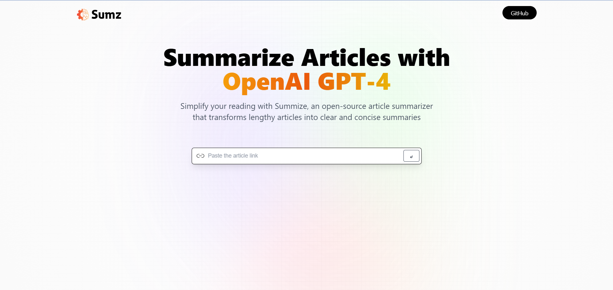

# AI Article Summarizer Website



A modern and efficient AI-powered article summarizer built with React.js, TypeScript, Redux, and Tailwind CSS.


## 📋 Table of Contents

- [🤖 Introduction](#-introduction)
- [⚙️ Tech Stack](#️-tech-stack)
- [🔋 Features](#-features)
- [🤸 Quick Start](#-quick-start)


## 🤖 Introduction

Summarize lengthy articles in just one click using the power of OpenAI models. This project is perfect for those looking to save time and quickly grasp essential information.

Need help or facing bugs? Join our active [Discord community](#) with over 27k+ members for support and networking.


## ⚙️ Tech Stack

This project is built using the following technologies:

- **React.js**
- **TypeScript**
- **Redux Toolkit**
- **Tailwind CSS**


## 🔋 Features

- **Modern User Interface**  
  An intuitive and visually appealing interface for seamless user interaction.

- **Summary Generation**  
  Input a URL, and the app generates a concise summary using AI.

- **History Management**  
  Save and manage your summary history locally with Local Storage.

- **Copy to Clipboard**  
  Easily copy summarized content for sharing or personal use.

- **Advanced API Handling**  
  Leverages Redux Toolkit's RTK Query for conditional and optimized API requests.


## 🤸 Quick Start

Follow these steps to set up the project on your local machine.

### Prerequisites

Ensure you have the following installed:

- [Git](https://git-scm.com/)
- [Node.js](https://nodejs.org/)
- [npm](https://www.npmjs.com/)

### Cloning the Repository

```bash
git clone https://github.com/PranayFadtare/Ai-Summarizer.git
cd Ai-Summarizer
